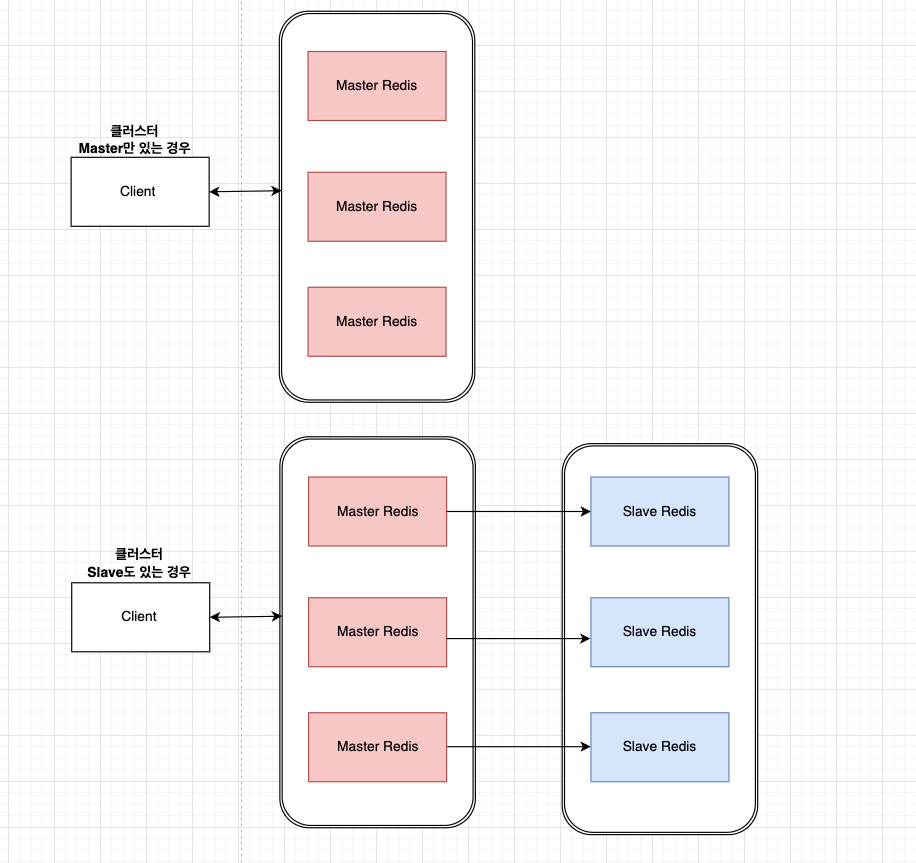

## 시작

레디스 구성에 대해서 글을 쓰려고 한다. 항상 어렴풋이 실무에서 인프라팀과 소통을 할 때 들었던 키워드들로 잠깐 공부하고 실무 커뮤니케이션을 했다. 이번에는 잠시 쉬는 동안 운영하고 있는 인베스팅뷰, 줌투자에 붙어있는 레디스를 공부하면서 전체적으로 여러 종류의 구성을 조사하고 공부해보려고 한다.

## 단일 인스턴스

그림에 보이는 것 처럼 단순히 하나의 Redis 서버만 존재한다. 이 구성은 설정이 간단하고 관리하기 쉽다는 장점이 있지만, 서비스에서는 웬만해서는 이런 구성을 하지 않는다. 이유는 고가용성에 취약하다. **Redis 서버에 장애가 발생하면 어떻게 될까 ?** 서비스 전체가 마비된다. 하나의 서버기 때문에 복제한 서버도 없기 때문에.

해당 같은 경우에 읽기 부하가 있는 경우, slave 추가하여 수평적확장에 기대할 수 있다. 쓰기 부하가 있는 경우에는 수평적확장이 까다롭다. 예를들어, 클러스터링일까나.. 불필요한 쓰기 작업을 제거하거나 파이프라이닝을 사용하여 여러 쓰기 명령을 그룹화하는 것도 좋은 방법이다. 해당 부분은 네트워크 비용을 절감할 수 있다.

## 레플리케이션

단일 인스턴스 레디스 같은 경우, 위와 같이 장애가 났을 때 서비스 측면에 큰 문제가 생길 수 있다. 그래서 레플리케이션으로 구성하면 쓰기를 할 때, Master 에만 쓰고 읽기를 할 때는 여러 Slave 서버에 읽기에 사용할 수 있어서 쓰기, 읽기 부하에 비용을 덜을 수 있다.

하지만 단일 인스턴스처럼 레플리케이션 구성에는 쓰기 부하에는 아직까지 해결을 할 수는 없다. 모든 데이터를 Master에 쓸 수 있기 때문에. 또한, Master 에 있는 데이터를 Slave 에 비동기로 보내 복제를 하기 때문에 항상 동기화가 됐다고는 보장할 수 없다.

## 클러스터 ( Matser 만 있는 경우, Slave 도 있는 경우 )

단일 인스턴스 레디스와 레플리케이션 구성에 있어서 계속 문제가 되는 경우가 바로 ‘쓰기’ 에 대한 부하를 해결하기에 까다로움이 있었다. 예를 들어, 데이터를 그룹화한다든지에 대한 비지니스 부분이 추가되야한다. 이 인프라적인 부분에서 해결하기 위해서는 클러스터부터 가능하다.

위에 그림을 보면 Master 를 하나의 클러스터 안에 구성하므로써 쓰기에 대한 부하를 3대로 분산(sharding)시킬 수 있다. 즉, 클러스터를 통해 여러 노드에 걸쳐 데이터를 분산 저장함으로써, 단일 노드에 대한 부하를 줄이고 전체 시스템의 처리량과 용량을 증가할 수 있다. 그러면 자연스럽게 고가용성에 대한 장점이 있다.

그럼, 첫번째 사진은 Master 만 여러대 있는데 이 구성에 대한 문제점은 무엇일까? 바로 복제가 없기 때문에 데이터에 대한 손실이 일어날 수 있다. 이 부분을 극복하기 위해선 두번째 사진처럼 각 Master 에 대한 Slave 를 추가하면 고가용성을 더 더욱 늘릴 수 있다.

## 센티널

센티널은 나에게 조금 혼란스럽게 했다. ‘서버일까 ? 시스템인가 ? ‘ 이해가 가지 않았다. 결국 찾아보니 하나의 서버에 하나의 ‘프로세스’로 작동하는 것이 센티널이다.

센티널의 큰 특징은 간단하다. 모니터링, 알림, 자동 장애복구, 구성관리 딱 이 부분만 생각하고 있으면 된다. 4가지의 각 특징을 알아보자.

1. **모니터링**: Sentinel은 Redis 서버 인스턴스(주로 마스터 및 그 슬레이브들)를 지속적으로 확인하여, 네트워크 불능, 과부하 등의 문제가 있는지 감시.
2. **알림**: 문제가 감지되면, Sentinel은 구성된 방식으로 시스템 관리자나 다른 시스템에 알림을 보낸다. 즉, 보통은 인프라팀에 모니터링하며 알림을 받고 개발자에게 알림을 알린다.
3. **자동 장애 복구**: 마스터 Redis 서버에 문제가 생겼을 때, Sentinel은 슬레이브 중 하나를 새로운 마스터로 자동 승격시키고, 나머지 슬레이브가 새 마스터를 따르도록 재구성.
4. **구성 관리**: Sentinel은 Redis 서버의 구성을 관리하고, 마스터 서버의 변경사항을 클라이언트와 다른 서버에 알린다.

## 끝내며

시간내서 자료를 찾아보고 알아보면 간단하게 구분할 수 있는 부분이었다. 내가 운영하고 있는 인베스팅뷰와 줌투자 같은 경우 인프라팀에서 센티널로 구축을 해주셨고 보통 메모리라든지 문제가 생길 경우, 슬랙으로 노티를 해주시는 편이다.