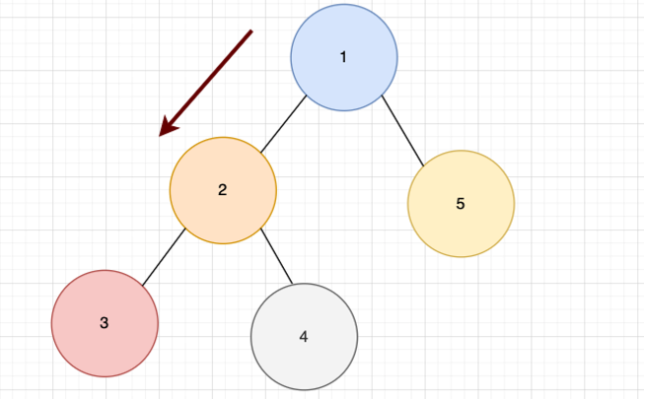

# Java 코테 틀

```java
import java.util.*; 를 쓰고 시작

class solution {

	 public int solution() {
      isPrime(10);
      return 0;
   }

   private boolean isPrime(int number) {
       return true;
   }

   static class A {
      private final int a;
      
      public A(int a) {
          this.a = a;
      }
   }
}
```

# HashMap - 각 key 에 대한 value 를 추적할 때

```java
Hash<String, Integer> hm = new HashMap<>();
hm.put("a", 3);
hm.getOrDefault("a", 0) 
hm.keySet();
hm.values(); 
```

보통 HashMap 같은 경우에는 그 key 에 대한 값들을 추적하면서 결과적으로 hm.keySet() 을 통해서 key 값들을 추출한다음에 get() 을 통해서 그 value 들을 가져와서 결과를 낸다.

```java
for (String str : hm.keySet()) {
    hm.get(key);
}

hm.put("a", hm.getOrDefault("a",0) + 1);
```

# HashSet - 중복을 없애고 싶을 때

```java
HashSet<Integer> hs = new HashSet<>();
Set<Integer> hs = new HashSet<>();
hs.add();
hs.size();
hs.contains(3);
hs.remove();
```

```java
if ( reserveSet.contains(a) ) reserveSet.remove(a)
else lostSet.add(a)
```

# String - 문자열

```java
String str;
str.substring(0, i);
str.length();
char[] strChars = str.toCharArray();
char c = str.charAt(i);
charAt(index)
```

```java
Arrays.sort(phone_book);
str.startsWith(str1);
c == 'a';
char c = 'a';
rny_string.replaceAll("m", "rn");

numStr.**chars()**.map(c -> c - 48).sum(); 
문자열 "abc"에 대해 chars() 메소드를 호출하면,
각 문자 'a', 'b', 'c'의 ASCII 코드 값인 97, 98, 99를 요소로 하는 IntStream이 생성

answer += (int)num_str.charAt(i) - 48;
String[] numArr= num_str.split("")

myString = myString.toLowerCase();
myString = myString.toUppercase();
myString.contains(pat); // 포함되는지 확인

String.valueOf(number) <- int 를 String 으로

char currentChar = my_string.charAt(i);
if (String.valueOf(currentChar).equals(alp)) {
         sb.append(Character.toUpperCase(currentChar));
} else {
         sb.append(currentChar);
}

String str = "ab sfd";
String result = str.replace(" ", "");
```

Arrays.sort 를 통해서 문자열도 정렬을 할 수가 있다. “a”, “b”

# StringBuilder

```java
StringBuilder sb = new StringBuilder();
sb.append(num); -> num 이 "" 문자열이여야함
sb.toString();
```

# Array - 배열

```java
ArrayList<Integer> list = new ArrayList<>();
List<Integer> list = new ArrayList<>();
list.add();

int[] arr = new int[list.size()];
int[] people = new int[n];

Arrays.sort(phone_book);
Arrays.copyOfRange(배열, 인덱스 첫시작, 잘리기전);
Arrays.sort(phone_book, (a,b) -> (b+a).compareTo(a+b)); 
```

```java
int[] supoja1 = {1,2,3}; 이렇게 반복적으로 간다면
answer[i] == supoja1[i % supoja1.length]; 이렇게 패턴을 이용해서 사용 가능
배열에 인덱스를 사람의 번호라고 하고 그 인덱스의 값이 상태값임 people[0] = 1 인덱스 0번에 체육복 존재

만약, 체육복이 있고 최대 2개, 최소 0개를 가지고있다고 한다면 표현을 할 때,
people[i] = 0, 1, 2 이렇게 표현 가능하다.

int[] arr;
int sum = Arrays.stream(arr).sum()

Arrays.sort(num_list);
int end = array.length - 1;
while (start < end) {
       int temp = array[start];
       array[start] = array[end];
       array[end] = temp;
       start++;
       end--;
}
```

# Integer, Double 등

```java
Integer.parseInt("010") : String 을 Integer 로
String.valueOf(number) <- int 를 String 으로
String answer = Integer.toString(n); <- int 를 String 으로
Integer.parseInt(""+a+b) : a = 10, b = 20 일때, 1020 처럼 합칠때
int leftInt = Integer.valueOf(leftStr);

String.valueOf 도 되고 Integer.valueOf 도 됨.

Integer.valueOf("010")
Integer.parseInt("010") 둘다 같은 값을 냄
```

```java
import java.util.*;
import java.util.stream.*;

class Solution {
    public int solution(int[] num_list) {
        int sumResult = Arrays.stream(num_list).sum();
        int mulResult = Arrays.stream(num_list).reduce(1, (a, b) -> a * b);

        // 모든 원소들의 합의 제곱과 모든 원소들의 곱을 비교
        return mulResult < Math.pow(sumResult, 2) ? 1 : 0;
    }
}

IntStream.of(num_list).sum();
Arrays.stream(num_list).sum()
```

# 배수

```java
number % n == 0 && number % m == 0 ? 1 : 0  number 가 **n, m 의 배수 일 때**
```

# Stack - 스택

```java
Stack<Integer> stack = new Stack<>();
stack.size();
stack.peek();
stack.push(num);
stack.pop();
stack.isEmpty();

peek(): 반환만함, 제거되지않음. 
pop() : 반환되고 제거도됨.
```

```java
Stack<Character> stack = new Stack<>();
```

# Math - 소수점이나 최대, 최소 등

```java
Math.ceil();
Math.max(a,b);
Math.min(a,b);
```

```java
int days = (int) Math.ceil((100.0 - progresses[i]) / speeds[i]); 를 
int days = (100 - progresses[i]) / speeds[i];
if ((100 - progresses[i]) % speeds[i] != 0) {
     days++;
}
```

# Queue - 제일 먼저 들어오고 제일 먼저 나가라 ex ) BFS

```java
Queue<Integer> q = new LinkedList<>();

q.add();
q.clear();
q.isEmpty();
q.size();
q.peek();   // stack과 마찬가지로 반환만함. 제거되지않음

q.poll();   // 반환 제거
q.remove(); // 반환 제거
```

# Heap - 가장 큰 최댓값, 작은 최솟값  O(logn)

```java
PriorityQueue<Integer> minHeap = new PriorityQueue<>();
PriorityQueue<Integer> maxHeap = new PriorityQueue<>(Collections.reverseOrder());

heap.add();
heap.offer();
heap.peek(); // 반환만
heap.poll();  // 제거 및 반환
```

```java
PriorityQueue<Work> startQueue = new PriorityQueue<>((o1, o2) -> o1.start - o2.start);
PriorityQueue<Work> timeQueue = new PriorityQueue<>((o1, o2) -> o1.time - o2.time);
-> 오름차순 ( default )

public static class Work {
    private final int start;
    private final int time;

    public Work(int start, int time){
        this.start = start;
        this.time = time;
    }
}
```

PriorityQueue 같은 경우에는 class 객체를 넣어서 해결하는 문제가 있다. 가령, 그 객체의 필드값을 이용하여 정렬을 하는 경우가 있다. 위의 예시를 보자.

# 2차 배열

```java
int[][] commands;
int[] answer = new int[commands.length];
```

```java
int[] array = new int[commands.length];
int[] temp = Arrays.copyOfRange(array, commands[i][0] - 1, commands[i][1]);
```

# Stream

```java
list.stream().mapToInt(i -> i).toArray();
```

# 순열

```java
private void permutation(String prefix, String str, Set<Integer> set) {
    int n = str.length();
    if (!prefix.equals("")) {
        set.add(Integer.parseInt(prefix));
    }
    for (int i = 0; i < n; i++) {
        permutation(prefix + str.charAt(i), str.substring(0, i) + str.substring(i + 1, n), set);
    }
}
```

# 소수

```java
private boolean isPrime(int number) {
    if (number < 2) return false;
    for (int i = 2; i <= Math.sqrt(number); i++) {
        if (number % i == 0) {
            return false;
        }
    }
    return true;
}
```

# DFS - 재귀 깊이 간다

```java
private int dfs(int[] numbers, int index, int sum, int target) {
     if (index == numbers.length) {
         if (sum == target) {
             return 1;
         }
         return 0;
     }

     int count = dfs(numbers, index + 1, sum + numbers[index], target);
     count += dfs(numbers, index + 1, sum - numbers[index], target);

     return count;
}

private void dfs(int[][] computers, boolean[] visited, int start) {
     visited[start] = true;

     for (int i = 0; i < computers.length; i++) {
         if (computers[start][i] == 1 && !visited[i]) {
              dfs(computers, visited, i);
         }
     }
}
```



# BFS - 하나의 기준점에 가까운것 부터 보자

```java
private void bfs(int[][] computers, boolean[] visited, int start) {
       Queue<Integer> queue = new LinkedList<>();
       queue.offer(start);
       visited[start] = true;

       while (!queue.isEmpty()) {
            int computer = queue.poll();

            for (int i = 0; i < computers.length; i++) {
               if (computers[computer][i] == 1 && !visited[i]) {
                   queue.offer(i);
                   visited[i] = true;
               }
           }
       }
   }
```

# 이분 탐색

```java
public long solution(int n, int[] times) {
    long answer = Long.MAX_VALUE;
    long minTime = 1;
    long maxTime = (long) n * getMax(times);

    while (minTime <= maxTime) {
        long midTime = (minTime + maxTime) / 2;
        long peopleProcessed = getPeopleProcessed(times, midTime);

        if (peopleProcessed < n) {
            minTime = midTime + 1;
        } else {
            answer = Math.min(answer, midTime);
            maxTime = midTime - 1;
        }
    }

    return answer;
}
```