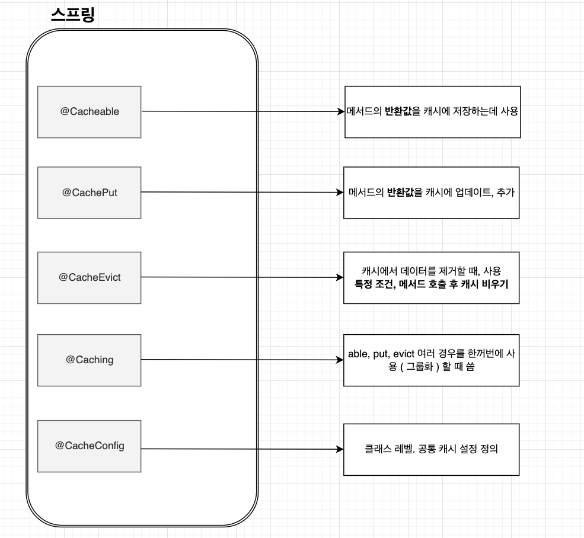
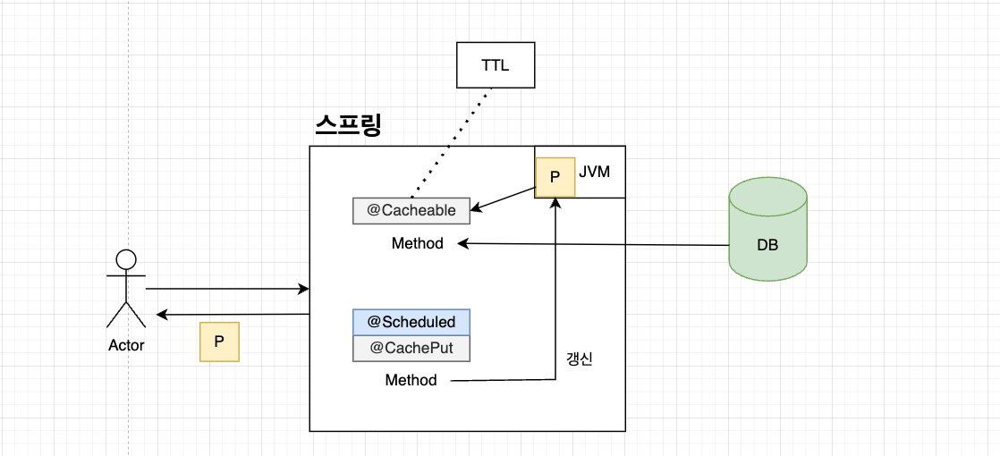
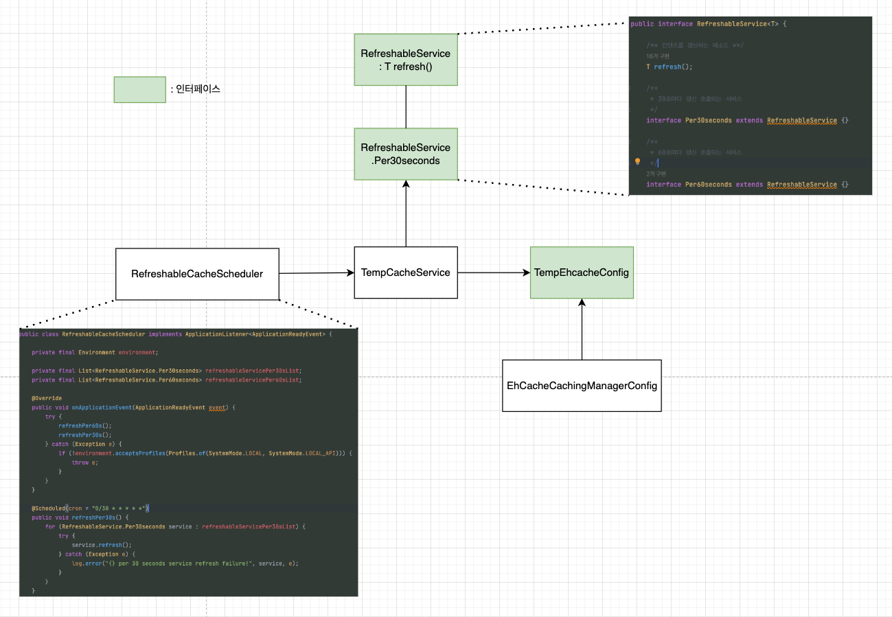

첫 호출을 통해 @acheable 로 JVM 또는 Redis 에 캐싱을 하고 나면 해당 데이터는 TTL이 걸려있지 않으면 계속 유지된 상태로 남아있게 된다. 
TTL 을 통해서 시간이 지나 데이터가 삭제되고 또 다른 호출을 통해 같은 키의 다른 데이터를 캐싱하면 데이터가 업데이트가 된다.

또 다른 방법으로는 주기적으로 데이터를 업데이트를 시킬 수 있다. 예를 들어, 데이터파이프라인을 통해 주기적으로 데이터가 들어올 때, 정해진 key에 업데이트를 해주거나 또는 @Scheduled 를 통해서 어플리케이션단에서 데이터를 업데이트 시켜줄 수 있다.

데이터파이프라인 같은 경우, 레디스와 연동하여 상호 작용으로 데이터를 주기적으로 업데이트해줄 수 있고 이번 블로그에 글을 쓰는 부분은 어플리케이션단에서 Local 데이터 업데이트에 대한 부분을 글로 써 내려갈 예정이다.

<br>

## 스프링 프레임워크에서 제공하는 캐싱관련 어노테이션에 대해 알아보자.



글을 읽다보면 그 당시에는 이해했다고 생각할 수 있지만 결국에 남는 건 ‘이미지’에 대한 이해와 그에 따른 ‘키워드’ 기억이라고 생각한다.

위의 그림을 보면 스프링에서 제공하는 어노테이션은 총 5가지다. 이 글에서 필요한 어노테이션은 @cacheable, @cachePut 이다. 인베스팅뷰, 줌투자 서비스를 운영하면서 데이터를 주기적으로 삭제를 하고 빈 상태로 유지하는 경우의 수는 없었으며 항상 데이터는 있되 주기적으로 업데이트가 필요로 해서 해당 2개의 어노테이션만 쓰고 있다.

그림에서도 볼 수 있듯이 좀 더 설명을 해보자면,

**`@Cacheable`** 어노테이션은 메서드의 반환값을 캐시에 저장하는 데 사용되고 메서드가 호출될 때, Spring은 먼저 해당 메서드의 매개변수를 기반으로 캐시에서 결과를 검색한다. 캐시된 값이 있으면, 메서드를 실행하지 않고 캐시된 값을 반환한다. 즉, 캐시된 값이 없을 경우에만 메서드가 실행되고, 반환값이 캐시에 저장된다

**`@CachePut`** 어노테이션은 메서드가 반환하는 값을 캐시에 강제로 추가하거나 업데이트하는 데 사용됩니다. 메서드가 호출될 때마다 실행되며, 반환값을 캐시에 저장한다.



 그림을 보면 첫 호출을 통해  @Cacheable 을 이용하여 JVM 에 캐싱처리를 하고 있다. 만약 이게 TTL 이 걸려있으면 히트를 치지 못하고
DB에서 다시 데이터를 가져와서 JVM에 저장한다. 

 또한, @CachePut 을 이용하여 주기적으로 DB에서 데이터를 가져와서 데이터를 갱신시켜준다.  


<br>

## 아키텍처와 코드로 알아보자.



```java
@Slf4j
@Service
@RequiredArgsConstructor
@CacheConfig(cacheNames = TempEhcacheConfig.TEMP_STORE_BOOK, cacheManager = CacheManagerType.EHCACHE)
public class TempCacheService implements RefreshableService.Per30seconds {

    @Override
    @CachePut(key = TempEhcacheConfig.TEMP_STORE_BOOK_, unless = "#result == null")
    public TempResponse refresh() {
        try {
            // return getTempData();
        } catch(Exception e) {
            log.error("There is an error `{}.refresh()` processing : {}", this.getClass().getName(), e.getMessage(), e);
            return null;
        }
    }

    @Cacheable(key = TempEhcacheConfig.TEMP_STORE_BOOK_, unless = "#result == null")
    public TempResponse getTempData(){
        // return Dao Response
    }
    
}
```

```java
public interface TempEhcacheConfig {

    String TEMP_STORE = "TEMP:CACHE:STORE:";
    String TEMP_STORE_BOOK = TEMP_STORE + "BOOK";
    String TEMP_STORE_BOOK_ = "'" + TEMP_STORE_BOOK + "'";

    default void addTempStoreCache(final net.sf.ehcache.config.Configuration config) {
        config.addCache(tempStoreCache());
        config.addCache(tempStoreCacheWithTTL());

    }

    private CacheConfiguration tempStoreCache() {
        return CacheConfigurationFactory.createWithTTL(TEMP_STORE_BOOK, 200L, 100);
    }

    private CacheConfiguration tempStoreCacheWithTTL() {
        return CacheConfigurationFactory.createWithTTL(TEMP_STORE_BOOK, 200L, 100);
    }
}
```

```java
@Slf4j
@Configuration
@EnableCaching(proxyTargetClass = true)
public class EhCacheCachingManagerConfig implements
        CachingConfigurer,
        TempEhcacheConfig,
        NewsEhcacheConfig {

    // 모듈 캐시 기본 설정
    private static final Boolean moduleCacheCacheEternal = true;
    private static final String moduleCacheEvictionPolicy = "LFU";
    private static final Long moduleCacheMaxEntriesLocalHeap = 500L;

    /**
     * 캐시 등록
     * @return CacheManager
     */
    @Bean(name = "ehCacheSettingManager", destroyMethod = "shutdown")
    public net.sf.ehcache.CacheManager ehCacheManager() {
        net.sf.ehcache.config.Configuration config = new net.sf.ehcache.config.Configuration();
        addTempStoreCache(config);
        addNewsCache(config);
        return net.sf.ehcache.CacheManager.newInstance(config);
    }

    @Bean(name = CacheManagerType.EHCACHE)
    @Override
    public org.springframework.cache.CacheManager cacheManager() {
        return new EhCacheCacheManager(ehCacheManager());
    }

    @Override
    public CacheResolver cacheResolver() {
        return new SimpleCacheResolver(cacheManager());
    }

    @Override
    public KeyGenerator keyGenerator() {
        return new SimpleKeyGenerator();
    }

    @Override
    public CacheErrorHandler errorHandler() {
        return new SimpleCacheErrorHandler();
    }

    /**
     * 모듈 캐시 기본 설정을 적용하는 메소드
     * @param name 캐시명
     * @return CacheConfiguration
     */
    static CacheConfiguration getDefaultModuleCacheConfiguration(final String name) {
        CacheConfiguration cacheConfiguration = new CacheConfiguration();
        cacheConfiguration.setName(name);
        cacheConfiguration.setEternal(moduleCacheCacheEternal);
        cacheConfiguration.setMemoryStoreEvictionPolicy(moduleCacheEvictionPolicy);
        cacheConfiguration.setMaxEntriesLocalHeap(moduleCacheMaxEntriesLocalHeap);
        return cacheConfiguration;
    }
}
```

```java
@Slf4j
@Component
@RequiredArgsConstructor
public class RefreshableCacheScheduler implements ApplicationListener<ApplicationReadyEvent> {

    private final Environment environment;

    private final List<RefreshableService.Per30seconds> refreshableServicePer30sList;
    private final List<RefreshableService.Per60seconds> refreshableServicePer60sList;

    @Override
    public void onApplicationEvent(ApplicationReadyEvent event) {
        try {
            refreshPer60s();
            refreshPer30s();
        } catch (Exception e) {
            if (!environment.acceptsProfiles(Profiles.of(SystemMode.LOCAL, SystemMode.LOCAL_API))) {
                throw e;
            }
        }
    }

    @Scheduled(cron = "0/30 * * * * *")
    public void refreshPer30s() {
        for (RefreshableService.Per30seconds service : refreshableServicePer30sList) {
            try {
                service.refresh();
            } catch (Exception e) {
                log.error("{} per 30 seconds service refresh failure!", service, e);
            }
        }
    }

    @Scheduled(cron = "0/60 * * * * *")
    public void refreshPer60s() {
        for (RefreshableService.Per60seconds service : refreshableServicePer60sList) {
            try {
                service.refresh();
            } catch (Exception e) {
                log.error("{} per 60 seconds service refresh failure!", service, e);
            }
        }
    }
```
