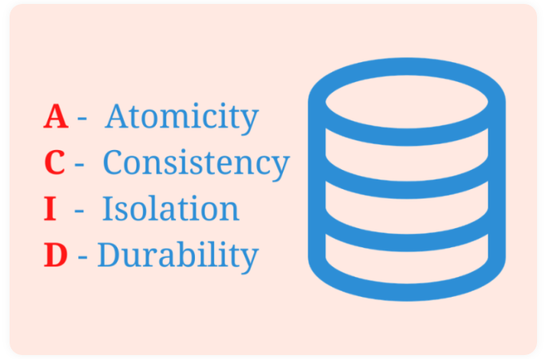
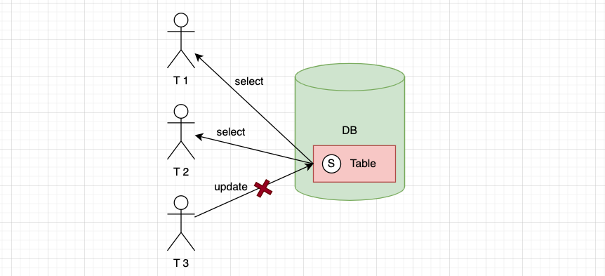
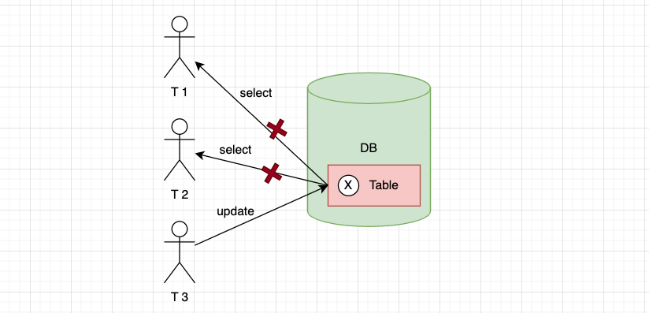

실무나 이론적인 공부를 하다보면 락에 대한 얘기는 끊임없이 나오는 것 같다. 공부를 해보자

## 공부하기전 선수 개념

**트랜잭션** : 데이터베이스에서 실행되는 하나의 논리적 작업 단위이다. 예를 들어, 은행 계좌 이체 작업은 하나의 트랜잭션이다.
- ACID
- 1. **원자성(Atomicity)**: 트랜잭션 내의 모든 작업은 완전히 수행되거나 전혀 수행되지 않아야 한다.
- 2. **일관성(Consistency)**: 트랜잭션은 데이터베이스의 일관된 상태를 유지해야한다.
- 3. **격리성(Isolation)**: 개별 트랜잭션은 동시에 실행되는 다른 트랜잭션으로부터 독립적이어야한다.
- 4. **지속성(Durability)**: 트랜잭션이 완료되면 그 결과는 시스템 장애가 발생해도 영구적으로 유지된다.

**커밋** : 트랜잭션의 모든 작업이 성공적으로 완료되었음을 데이터베이스에 알리는 과정이다. 커밋을 통해 변경 사항이 데이터베이스에 영구적으로 저장한다.
- 트랜잭션을 **‘커밋’** 하여 변경사항을 데이터베이스에 반영한다.

**세션** : client ( application 서버 ) 하고 db 하고 연결되어 있는 전체적인 시간이다.
- 연결 풀을 사용하는 경우, 여러 I/O 작업이 같은 세션을 재사용한다.
- 연결 풀을 사용하지 않는 경우, 각 I/O 작업마다 새로운 세션을 생성한다.

## 락이란? 
DB 는 여러 사용자들이 같은 데이터를 동시에 접근하는 상황에서 세션이 **트랜잭션을 시작**하고 데이터를 수정하는 동안에는 **커밋이나 롤백 전까지 다른 세션에서 해당 데이터를 수정 할 수 없게 해야한다**.

- Lock “잠금”

## 락 종류

**공유 락 ( Shared Lock )**

- 데이터를 조회할 때 사용된다. Read Lock 이라고도 불리고 Shared 의 앞글자를 따서 주로 S락이라고 하기도 함.
- 여러 사용자가 같은 데이터를 동시에 볼 수 있지만 그 다른 사람이 1명이라도 보고 있으면 변경이 불가능하다.

**베타 락 ( Exclusive Lock )**

- 데이터를 변경할 때 사용된다. Write Lock 이라고도 불리고 X로 표기한다.
- 아예 베타락이 걸려있으면 Select 하는 세션이라든지 Insert 하는 세션이라든지 데이터에 접근할 수 없다.

**비관적 락 ( Pessimistic Lock )**

- 하나의 트랜잭션이 데이터를 읽는 시점에서 락을 걸고 조회 또는 갱신 처리가 완료 될 때까지 그 Lock 이 유지된다. 조회 때 락 잠금을 획득하는 방법은 대표적으로 Select .. For Update 이다. 즉, 조회할 때! Lock을 가져간다.

**여기서 잠깐 ? 베타 락과 비관적 락의 차이점을 모르겠다.  ** 

- 배타 락은 데이터에 대한 독점적인 접근 권한을 부여하는 특정한 락 유형이다.
- 비관적 락은 데이터베이스 충돌이 발생할 것을 가정하고, 이를 방지하기 위해 트랜잭션 동안 지속적으로 락을 설정하는 전략이다.

## 락 시나리오

각 세션들의 트랜잭션에서 같은 데이터를 접근하려고 했을 때, 그 데이터에 하나의 트랜잭션이 S 락을 요청하고 다른 하나의 트랜잭션도 S 락을 요청했을 때는 블로킹이 안됨

- S락과 S락은 블로킹 안됨

다만, 각 트랜잭션에서 하나의 데이터에 S 락이 있고 X 락을 요청할 때, 블로킹이됨. X 락이 있는 데이터에도 똑같이 X락을 걸 수 가 없음.

- S락과 X락은 블로킹이 됨
- X락과 X락도 블로킹이 됨

블로킹에서 더 나아가 양쪽 트랜잭션이 모두 영원히 처리가 되지않은 상태가 될 때, 예를 들어 하나의 트랜잭션은 A 에 대해서 S락을 획득하고 Sleep. 또 다른 트랜잭션은 해당 데이터에 X 락을 걸려고 하면 계속 기다려야한다.

- Dead Lock “교착상태”

## 락 범위

어떠한 데이터에 트랜잭션이 실행했을 때, 접근제한의 범위는 어디까지 일까? 

**데이터베이스** : DB 의 소프트웨어 버전을 업그레드 하거나 DB 업데이트를 진행할 경우

**파일**

**테이블** : DDL ( create, alter, drop ) 할 때 주로 쓰며 DDL Lock 이라고 한다.

**페이지와 블럭**

**컬럼**

**행**

## 해결 방법

- 각각의 트랜잭션이 빠르게 실행되도록 해야한다.
- 그래야 그 데이터간의 락 Race Condition 이 생기지 않음
- 동시에 접근을 안하게 하는게 좋음
- 대용량 → 작업 단위를 쪼개거나 Lock Time out 을 설정
