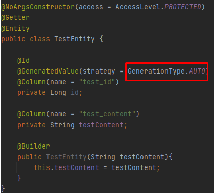
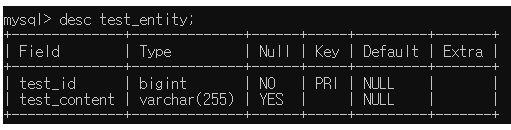
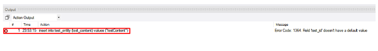
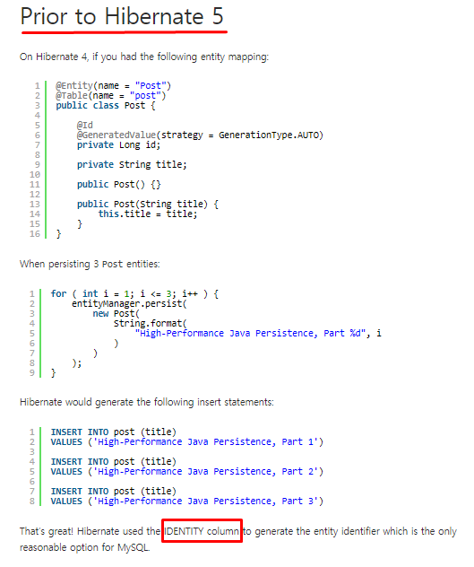
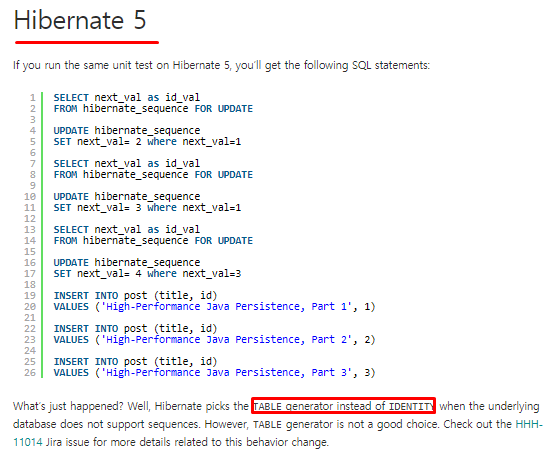
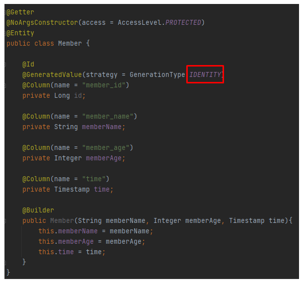
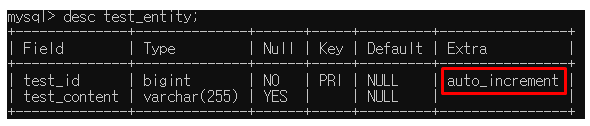
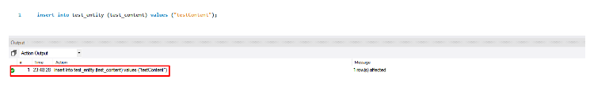

**시작**

오늘 Entity 하나를 만들 때 낯선 오류를 발견했다. 최근에 복합키를 이용한 Entity를 만들어서 그런지 Auto-Increment를 이용한 Entity를 만들고자했들고자 했을 때, insert into Table values 가 먹히지 않은 것이었다. 그래서 한번 찾아보고 공부해봤다.

**사건**

- Entity

- 스키마
위의 코드처럼 Entity를 만들었고 GenerationType을 AUTO로 넣어주었다.
MySQL Bench를 열어 Insert를 해준결과..

짜잔 ! insert가 되지 않고 에러를 뿜어냈다. 이유가 무엇일까?

**Insert into table values 가 먹히지 않은 이유**

- Hibernate 5 버전의 전

- Hibernate 5 버전의 후

**결론 - GenerationType.IDENTITY 를 쓰자**

- Entity
  

- 테이블 스키마
  

- insert 결과

