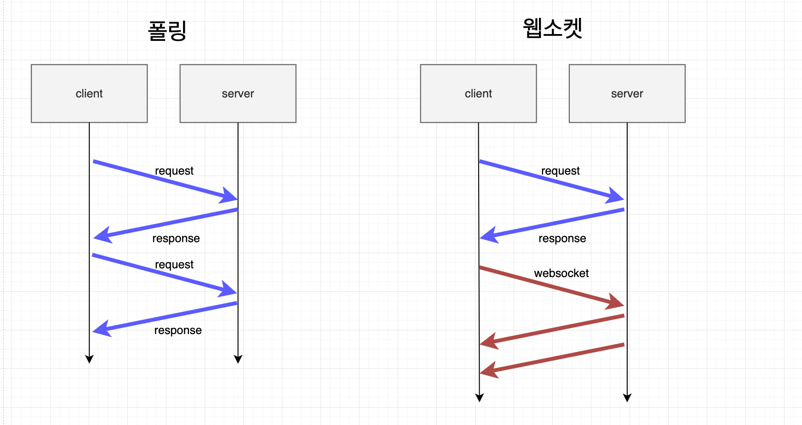

줌인터넷에서 가장 흥미로운 프로젝트를 맡아서 진행했다. 바로 줌투자 & 인베스팅뷰 의 모든 데이터를 적재할 수 있는 데이터파이프라인을 구축하는 프로젝트다. 2023년 1월 25일, 기존 파이프라인에서 차세대 파이프라인을 구축 완료 및 배포를 하였고 운영을 하면서 10월 중순 경에 Polling 서비스에서 WebSocket 서비스로 전환하는 프로젝트를 맡아서 진행했다.

## 적용하기전 전체적인 아키텍처


금융 데이터를 제공해주는 증권 유관기관으로 부터 데이터를 받고  SpringIntegartion 프레임워크를 이용하여 데이터 가공하고 카프카에 Publish 를 하였다.

가공된 데이터는 해당 Topic 에 따라 카프카 클러스터에 데이터를 보내 Load 모듈에서 데이터를 Consume 하였다.  데이터는 Redis 에 적재가 되고 적재된 데이터는 서비스 어플리케이션 서버(줌투자 & 인베스팅뷰) 에서 key 설계에 맞게 데이터를 뽑아내서 서비스 운영중에 있다.

## 왜, Polling 의 방식에서 WebSocket 방식으로 전환하였는가 ?



항상 '왜?'라는 질문은 중요하고 동시에 어려운 과제라고 한다. 운영 중인 주식 서비스에서는 **실시간 데이터 전송**과 **최신 상태 유지**가 필수적이다. 이전에는 폴링 방식을 사용하여, 예를 들어 인베스팅뷰 서비스의 경우 10초마다 클라이언트가 서버에 데이터를 요청을 했다.

하지만 이런 폴링 방식에는 한계가 있었고 단순히 데이터를 보여주는 서비스라 할지라도, 사용자 경험 개선을 위한 노력이 필요했다.

- **서버 부하와 스레드 한계**: 폴링 방식은 클라이언트가 서버에 연결할 때마다 새로운 커넥션을 맺어야 하므로 서버에 부담을 줄 수 있다. 특히, 톰캣 같은 서버에서는 동시에 처리할 수 있는 스레드 수에 한계가 있어, 많은 요청이 동시에 이루어질 때 성능 문제가 발생할 수 있다.
- **실시간 성 저하**: 폴링 방식은 데이터 연결이 끊어졌다 재연결되는 과정에서 실시간 시세의 지연이 발생할 수 있다. 이는 주식 서비스에서 실시간 정보의 중요성을 고려했을 때, 큰 단점으로 작용할 수 있다.

반면, 웹소켓 방식은 이러한 문제를 상당 부분 해결할 수 있다. 한 번의 커넥션으로 데이터가 실시간으로 전송되기 때문에 서버 부하를 줄이고 사용자 경험을 개선할 수 있다. 폴링 방식과 비교했을 때, 데이터 전송의 지연이 현저히 줄어들며 이는 주식 서비스에서 빠른 반응 속도와 신뢰성을 제공하는 데 큰 이점을 가져다준다.

결국, 웹소켓을 사용하는 것은 클라이언트와 서버 간의 효율적인 성능 향상을 가능하게 하며 서비스를 이용하는 사용자들에게 보다 좋은 경험을 제공한다.

## 체결할 때마다 들어오는 데이터를 다 받아낼 수 있었나?


1초에 많으면 900개 정도의 종목에 대한 체결 데이터. 적으면 600개 정도의 데이터가 쏟아져 나오기 때문에 문제가 있었다. redis pub/sub 을 이용하여 데이터를 보낼 때, 서버측에서는 웹소켓 어플리케이션 서버에서도 부하가 있었고 만약, 서버에서 부하를 견뎌냈다고 해도 클라이언트에서도 1초에 900개 정도의 데이터를 받아내기에는 문제가 있었다.

‘ **어떻게 이 부하를 해결할 수 있을까?** ‘


그래서 생각했다. 이 모든 데이터를 전부 보내줄 수는 없다. 기획자, 개발자와 커뮤니케이션을 통해 어느 정도의 데이터는 버려야했다.  ‘**n초 안에 데이터 주기로 업데이트가 필요로하다**’. 이 n초는 우리는 2초로 결정하였다. 2초 동안의 데이터를 모아서 그 종목에 따른 최신의 데이터를 필요로 했다.

## 왜, Kafka Streams 를 이용하였는가 ?


Google의 Guava 라이브러리에 포함된 RateLimiter를 사용하여 Java로 직접 스루틀링을 구현할 수도 있었다.

우선 이유 중에 가장 큰 것은 **카프카 스트림즈의 윈도우 기능**이라고 할 수 있다. 또 다른 큰 이유는 **카프카를 쓰고 있기 때문에** 라고 할 수 있다.  아파치 카프카에서 제공하는 라이브러리기 때문에 호환성과 개발 생산성에 이점이 가장 먼저 생각이 났다. 또한, 해당 라이브러리는 대용량의 스트리밍 데이터를 효과적으로 처리할 수 있기 때문에 매우 적합했다. 또한, 나름의 도전을 하고 싶었다. 카프카에 대한 욕심이 개인적으로도 있었기 때문이다.

- 위에 글에서도 썼지만 카프카와 카프카 스트림즈와의 호환이 잘되어있기에 다양한 기능이 제공된다.
- 또한, 확장성에 이점이 있다. 카프카 스트림즈도 내부적으로 데이터를 받을 때 Consume 과 같은 동작이 있기에 스케일링에도 이점이 있다.
- 직접 구현할 수 있지만 일정과 생산성으로 인해 더 유리하다고 생각했다.
- 카프카 스트림즈의 윈도우 기능이 해결 과제에 매우 적합한 기능으로 보였다.

## Kafka Streams 어떻게 적용하였는가 ?

Kafka Streams 에 대해서 무지했기 때문에 데이터가 어떻게 흘러가는지에 대해서 먼저 리서치가 필요로 했다. 간단하게 데이터 흐름을 이론으로 알아보았다. 직접적으로는 코스콤에서 오는 데이터를 레디스에 있는 데이터에 끌어다써서 데이터가 직접 오는 것처럼 테스트가 구축되어 있기 때문에 해당 시스템을 통해 로컬 환경에서 데이터 보면서 확인을 하였다.

```java
fun kStream(builder: StreamsBuilder): KStream<String, String> {
    val stockTradingStream = createStockTradingStream(builder)
    val mappedStream = mapToIsinStockCode(stockTradingStream)
    val groupedStream = mappedStream.groupByKey(Grouped.with(Serdes.String(), Serdes.String()))
    createWindowedTable(groupedStream)
        .transformValues(StockTradingSupplier(objectMapper, redisPublish), "stock-trading-store")

    return stockTradingStream
}
```

직접 구현한 코드를 순차적으로 간단히 설명하겠다.

1. createStockTradingStream 를 통해 주식 체결 데이터에 대한 스트림을 생성하는 과정
2. mapToIsinStockCode 를 통해 주식 체결 데이터 스트림에서 각 메세지 Isin 종목 표준코드를 key 로 설계하여 KStream 을 생성하는 과정
3. groupByKey 내장된 기능을 이용하여 KStream 에서 키별로 데이터를 그룹화하여 KGroupedStream 생성하는 과정
4. createWindowedTable 은 Kafka Streams를 사용하여 시간 기반 윈도우를 적용한 KTable 을 생성하는 과정

이러한 일련의 과정들을 통해서 KTable 을 생성하고 그 저장된 데이터를 이용하여 redis에 주기적으로 publish 를 해준다. 이제는 이러한 일련의 과정들을 좀 더 상세히 설명을 해볼 차례이다.

**‘createStockTradingStream 를 통해 주식 체결 데이터에 대한 스트림을 생성하는 과정’**

```java
private fun createStockTradingStream(builder: StreamsBuilder): KStream<String, String> {
    return builder.stream(
        stockTradingTopic,
        Consumed.with(Serdes.String(), Serdes.String())
    )
}
```

StreamsBuilder 를 사용하여 스트림 토폴로지를 구성한다. 토폴로지에 대한 이해가 안될 수 있는데 Kafka Streams In Action 에 나온 부분을 같이 보면,

> ‘전체 시스템의 부분을 배열하고 서로 연결하는 방법. 하나 이상의 프로세서를 실행해 데이터를 반환한다는 의미’
>

이해하기 어려울 수 있다. 간단하게 생각하면 데이터가 들어오면 그 데이터를 각각의 모듈 (노드) 를 거쳐가면서 데이터를 입맛에 맞게 가공 후, 최종적으로 데이터를 출력하는 과정. 이러한 과정들의 집합체라고 생각하면 이해하기 쉬울 것이라고 생각한다.

이러한 토폴로지를 구성하기 위해선 데이터를 받고 그 데이터를 Stream 을 만들어야하는데 이 과정 속에서 Key와 Value 를 Serdes 를 이용하여 지정해준다. 예를 들어, 위와 같은 체결 데이터는 KStream<String, String> 타입을 반환하는데 키와 값이 모두 문자열인 레코드 스트림을 의미한다.

**‘mapToIsinStockCode 를 통해 주식 체결 데이터 스트림에서 각 메세지 Isin 종목 표준코드를 key 로 설계하여 KStream 을 생성하는 과정’**

```java
private fun mapToIsinStockCode(stockTradingStream: KStream<String, String>): KStream<String, String> {
    return stockTradingStream.map { _, value ->
        val parsedData: StockTrading = objectMapper.readValue(value, StockTrading::class.java)
        val isinStockCode = parsedData.isinStockCode
        KeyValue(isinStockCode, value)
    }
}
```

위의 설명으로 KStream은 <String, String> 타입을 반환한다.  단순히 타입을 정의했을 뿐 키와 값에는 어떤 데이터를 넣을지는 정하지 않았기에 이 과정에서 정하는 과정이다. 객체 형태를 사용할 수 있도록 역직렬화하여 StockTrading 객체의 표준코드를 이용하여 키를 설계한다. 그리고 그 원본 그자체는 값으로 설계한다. 반환은 Kstream<String, String> 타입으로 같다.

**‘createWindowedTable 은 Kafka Streams를 사용하여 시간 기반 윈도우를 적용한 KTable 을 생성하는 과정’**

```java
private fun createWindowedTable(groupedStream: KGroupedStream<String, String>): KTable<Windowed<String>, String> {
    val windowDuration = Duration.ofSeconds(WINDOW_DURATION_SECONDS)
    val materialized: Materialized<String, String, WindowStore<Bytes, ByteArray>> = Materialized
        .`as`<String, String, WindowStore<Bytes, ByteArray>>("stock-trading-store")
        .withKeySerde(Serdes.String())
        .withValueSerde(Serdes.String())
        .withRetention(Duration.ofSeconds(WINDOW_RETENTION_SECONDS))
        .withLoggingDisabled()

    return groupedStream
        .windowedBy(TimeWindows.ofSizeWithNoGrace(windowDuration))
        .reduce({ _, newValue -> newValue }, materialized)
}
```

Kafka Streams 를 쓴 가장 큰 이유다. 윈도우에 대한 기능이 있기 때문에 가장 적합했다. Duration.ofSeconds(WINDOW_DURATION_SECONDS)을 이용하여 윈도우의 지속 시간을 설정한다. 즉,

해결 과제인 2초간의 데이터를 모아서 가장 최신의 데이터를 가지게끔 하는 그 2초의 시간이 이 시간이다. stock-trading-store 라는 이름으로 윈도우 데이터를 저장할 상태 저장소를 설계하였고 해당 데이터가 계속 누적이 되면 문제가 되므로 보존기간을 설계하였다. 이러한 스트림을 시간 기반 윈도우를 그룹화하여 reduce 를 이용하여 항상 최신 값만을 유지하도록 하였다.


이러한 일련의 과정들이 처음 접했을 때 매우 이해하기 힘들었다. 리서치를 해보고 책을 사서 읽어보았다. 앞서 터득한 지식은 시간이 흐르면 잊어먹고 또 다시 터득을 해야했으므로 그림을 그리면서 이해하려고 했고 위의 설계된 그림이 책읅 읽으면서 나름 설계한 나의 그림이며 흔적이다. 틀린 부분도 있을 수 있겠지만 이해에 도움이 되길 바란다.

## State Store에 저장된 KTable 은 어떻게 Redis 에 Pub 하는 건가 ?

설명하기 앞서 State Store 은 간단히 서버 로컬 저장소라고 생각하면 되고 위에서 만든 2초간의 집계된 데이터가 kTable 이며 즉, 윈도우라고 생각하면 된다. 위의 과정으로 로컬 저장소인 State Store 에 KTable 이 저장된다.

위의 코드에서 ‘**StockTradingSupplier**' 를 설명을 하지 않았다. 이 부분이 저장된 KTable 즉, 윈도우를 Redis에 publish 하는 과정이 들어가있다.

```java
override fun init(context: ProcessorContext) {
    this.stateStore = context.getStateStore("stock-trading-store") as TimestampedWindowStore<String, String>
    context.schedule(
        Duration.ofMillis(WINDOW_DURATION_SECONDS),
        PunctuationType.WALL_CLOCK_TIME
    ) { _ ->
        val timeTo = Instant.now()
        val timeFrom = Instant.ofEpochMilli(timeTo.toEpochMilli() - Duration.ofMillis(5_000).toMillis())
        var latestWindowEnd: Long = -1
        this.stateStore?.let { stateStore ->
            val iterator = stateStore.fetchAll(timeFrom, timeTo)
            val recordList = mutableListOf<StockTradingRedisResponse>()
            iterator.use {
                while (it.hasNext()) {
                   // ...
                  
                   publish    

                   // ...
                }
            }

            if (recordList.isNotEmpty()) {
                  // logic
            }
        }
    }
}
```

Kafka Streams를 사용하여 처리한 데이터를 주기적으로 Redis에 Publish를 해야한다.  Kafka Streams의 기능 중, Processor API에 내장된 punctuate 를 사용하고, 윈도우 기반의 상태 저장소에서 데이터를 주기적으로 추출한 후 Redis를 이용하여 Publish를 한다.

여기서 주기적으로 스케줄링하기 하기 위해 punctuate 를 썼는데 State Store 의 현재 시간에서 5초 전의 데이터들을 조회하였고 그 이전의 데이터는 무시하고 최신 윈도우의 데이터만을 추출했다. 밑에 그림을 보면 이해하기 쉽다.


## 왜 그렇게 적용하였고 문제가 무엇이 있었는가 ?

우선 나는 현재 아키텍처, 일정내로 해야하는 상황에서 ‘**윈도우를 만들자 마자 redis publish**’ 하는 것이 최상의 시나리오라고 생각했다. 하지만, 쉽지않았다.

**suppress() 에 대한 적용 실패**

윈도우를 만들자마자 redis publish 를 하기 위해서 여러 방면으로 리서치를 했다. 항상 개발을 하면서 ‘**내가 하고자 하는 기능들은 무조건 있다고 생각했고 내가 못찾는 것이다**’ 라는 생각을 가졌었는데 이번에는 달랐다.

```java
return groupedStream
        .windowedBy(TimeWindows.ofSizeWithNoGrace(windowDuration))
        .reduce({ _, newValue -> newValue }, materialized)
        **.suppress(Suppressed.untilTimeLimit(Duration.ofSeconds(2), Suppressed.BufferConfig.unbounded()))**
```

Ktable 을 만들때, **suppress** 함수를 추가하여 저수준의 Processor API 를 굳이 사용하는 것이 아닌 간편하게 적용하여 redis 에 출력이 가능할 줄 알았다. 하지만, 여러 리서치 및 책을 본 결과 그러한 기능은 존재하지 않았다. 물론, stackoverflow 의 질문들이 나와 같은 질문이 많았는데 답변에는 suppress 를 쓰라는 답변이 많았지만 적용되지 않았다.

**StreamsConfig.COMMIT_INTERVAL_MS_CONFIG**

```java
@Bean
fun kafkaStreamsConfiguration(): KafkaStreamsConfiguration {
    val props: MutableMap<String, Any?> = HashMap()
    props[StreamsConfig.APPLICATION_ID_CONFIG] = applicationId
    props[StreamsConfig.BOOTSTRAP_SERVERS_CONFIG] = brokers
    props[StreamsConfig.DEFAULT_KEY_SERDE_CLASS_CONFIG] = StringDeserializer::class.java.name
    props[StreamsConfig.DEFAULT_VALUE_SERDE_CLASS_CONFIG] = org.springframework.kafka.support.serializer.JsonDeserializer::class.java
    props[org.springframework.kafka.support.serializer.JsonDeserializer.TRUSTED_PACKAGES] = "*"
    props[StreamsConfig.REPLICATION_FACTOR_CONFIG] = replicationFactor
    props[ConsumerConfig.AUTO_OFFSET_RESET_CONFIG] = "latest"
    props[StreamsConfig.STATE_DIR_CONFIG] = "../state-store"
    **props[StreamsConfig.COMMIT_INTERVAL_MS_CONFIG] = 2_000**
    return KafkaStreamsConfiguration(props)
}
```

Processor API 를 고려하기 전에 어플리케이션 설정 상에서 컨트롤 할 수 있도록 **COMMIT_INTERVAL_MS_CONFIG** 을 찾아 설정을 하려고 했다**.** 하지만 ****구현하는 부분에 있어서 지푸라기라도 잡고 싶은 생각에 시도를 한 부분이였다. 어플리케이션단의 전체적인 설정에 영향이 가는 부분이였고 정확한 일정 시간내의 집계를 활용하지 못해 데이터에 대한 신뢰성이 깨진다는 것이 문제였다.

**윈도우별로 정렬이 아닌 key 값으로 정렬**

```java
val storeQueryParameters = StoreQueryParameters.fromNameAndType(storeName, QueryableStoreTypes.windowStore<String, String>())
val windowStore = kafkaStreams.store(storeQueryParameters)
val results = windowStore.all()
```

‘ t0 ~ t0 + a ‘ a시간만큼 집계하여 윈도우로 만들고 State Store에 적재했을 때, 윈도우가 적재된 순서대로 정렬될 줄 알았다. 하지만,  해당 로직을 작성하여 저장된 데이터를 확인해보니 각, 키에 대한 정렬 그다음 윈도우 시간에 대한 정렬로 저장되어있었다. 그래서 가장 추출하기 위해 나름의 해결을 하였다.


5초 전의 윈도우 시간들만 탐색 조건에 걸고 최신의 윈도우만 걸러주는 간단한 알고리즘 ( 시간 복잡도 N ) 정도의 탐색으로 구현하여 데이터를 추출하였다.

## 왜, Window 기법에서 ****Tumbling Windows 를 선택하였는가 ?****

kafka streams 에서는 여러 가지 window 기법을 제공한다. 이번 실시간 시세에 적용한 window 기법은 Tumbling windows 기법을 사용했다. 우선, 쓰지 않은 3가지 window 기법을 설명하겠다.

**hopping windows**

Tumbling windows 와 비슷하지만 일정 간격으로 이동이 가능하기 때문에 윈도우가 중첩될 수 있다. 예를 들어, 1초에서 3초 동안의 데이터 집계를 얻은 A 블록. 2초에서 4초 동안의 데이터 집계를 얻은 B 블록. 즉, 2초 ~ 3초 구간의 데이터가 중첩이 될 수 있다. 중복이 될 수 있으므로 실시간 시세에 적합하지 않았다.

**Sliding Windows**

이벤트 간의 최대 시간 간격을 기준으로 윈도우를 생성한다. 즉, 레코드의 Timestamp에 따라 윈도우가 겹치는 부분이 있을 수 있기에 실시간 시세에 적합하지 않다. 고정적인 윈도우라 할지라도.

**Session Windows**

Session windows 같은 경우에는 윈도우 자체가 유일하게 고정적인 부분이 아니라서 애초에 실시간 시세에 적합하지 않은 기법이였다.

**Tumbling Windows**

Thumbling windows 는 실시간시세에 적합했는데, 고정된 윈도우를 지원하며 중첩되는 부분이 없었기에 종목에 대한 시세 중복없이 구현을 할 수 있다.


## 적용 후 전체적인 파이프라인 및 결과물


<video src="../images/RPReplay_Final1703204357.MP4" style="display: block; margin: auto; width: 40%;" controls>
  Your browser does not support the video tag.
</video>

## 완벽하지 않다. 어떤 문제가 남아있는가 ?

**파티션 별로 중복된 종목이 존재**

Kafka Streams에서는 각 파티션의 데이터를 별도로 처리한다. 이는 Kafka의 토픽이 여러 파티션으로 분할될 수 있으며, Kafka Streams 애플리케이션(Load)은 각 파티션을 독립적으로 처리하기 때문에 중복을 처리하는 부분에서는 Stream Task 는 특정 파티션을 처리하여 Punctuate 를 실행하게 하였다. 즉, 각 파티션은 중복된 종목 데이터가 없지만 그 파티션끼리는 중복된 종목이 있으므로 Websocket Application 에서 시간에 대한 비교 로직이 한번 더 들어가야했다. 물론, 현저히 처리해야하는 데이터양이 줄었기에 충분히 가능했다.

**카프카 토픽과 파티션에 대한 제대로 된 구축**

차세대 파이프라인을 구축했을 당시, 토픽 설계에 있어서 문제점을 인지하지 못했다. 체결에 대한 Topic 하나만을 설계했고 이 Topic에 모든 체결 데이터가 들어왔다.

Kafka Streams 를 구축하면서 애초에 ‘**체결 Topic**’ 아닌 ‘**업종 또는 지수 별로 Topic을 나눴으면 어땠을까?**’ 라는 생각이 들었다. 그러면, 앞서 말한 파티션 별로 중복된 종목이 존재하는 일도 없을 것 이다.

**일정 및 서버 비용**

kafka streams 를 적용한 어플리케이션을 따로 서버를 구축했으면 좋았다고 생각한다. 원본 데이터를 가공하여 최종 결과인 윈도우를 로컬 저장소에 임시적으로 저장하는 것이 아닌 새로운 Topic에 넣었으면 좀 더 가용성과 확장성에 이점이 있을 것이라고 생각한다.

다만, 일정이 중요했고 또 다른 서버를 구축하는 것은 비용에 문제가 있었기에 기존 파이프라인에 스펙을 고려했을 때 충분하다고 생각하였고 구축하였다.

## 끝내며


일정이 있었고 책임감으로 부담이 있었던 시간이었다. 하지만 결과가 좋았고 그 과정들을 되새겨 보았을 때, 리서치에 대한 한계점을 도달하고 거기서 끝나는 것이 아닌 관련 책을 구입하여 완독 후, 기능이 없다는 것을 스스로 확답을 받고 차선책을 생각해냈다는 것에 스스로 큰 점수를 주고 싶다.